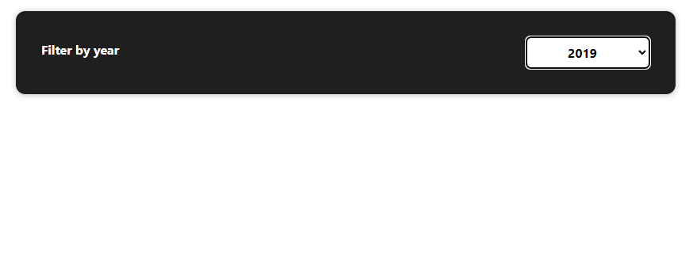

## About React
React is a client library which focuses on building the HTML DOM by using components.

The components are Javascript functions (or classes, React support both approaches) that return JSX.

JSX is a syntax extension in Javascript that allows the developers to write the syntax of HTML inside a Javascript file. The JSX itself requires the React library to iterpret this syntax into an actual HTML element inside the DOM.

React focuses on decoupling the HTML page by creating components for each part of the page. A component can be an entire section, a form or a single button.
This way of architecture allows the developer to reuse the same component in multiple implementations, instead of creating the same HTML code twice for several different things.

Splitting the website into components also allow React to only change one aspect of the DOM if it requires change while the use interacts with the website, 
since React uses a thing called "virtual DOM".

The virtual DOM is a representation of the actual UI that is kept in the computer memory
and is synced with the actual DOM in the browser after the rendering of the components.
The reason React will want to keep such virtual DOM and not just use the actual DOM is so if a change
occurs in one of the components by any user action (like adding a new item to a list via a form) instead of rendering the entire UI in the browser all over again,
React will compare the newly formed DOM based on the user interaction against the virtual DOM and will only change the part in the virtual DOM where the UI has changed, 
without re-rendering the entire page, which gives React the advantage of being very fast when used in dynamically-changing UIs on websites.


## First Project

#### installation
Before creating a React app, npm and node.js must be installed on the machine, This can be downloaded in the node.js website. When installing node.js it will also install npm automatically.

After npm and node.js are installed, the React project can be created calling this line from the command line:

```bash
npx create-react-app <appname>
```

This command will create a directory inside wherever this command was running in and will pull all the necessary code to start the React project from this repository: https://github.com/facebook/create-react-app
The <appname> should be changed to whatever project name you want to give it (no spaces allowed, usually "-" is used to separate between project name words.

After putting all the files in the project directory, this command will also run "npm install" in order to install all the necessary dependencies that the Reach project requires.

After the command is complete, simply navigate to the project directory location using the terminal and run:

```bash
npm start
```

in order to start the development server on your machine.

This will use the port 3000 in the localhost environment and when reaching localhost:3000 we can see that there is a react template page showing, if everything worked as expected.

In the project files, we can see that a file called "package.json" is created. This file contains all the necessary dependencies that were installed when creating the project.
Every new dependency that will be installed in this project using npm will be saved under the "dependencies" object.

In the project there is a directory called "src". This directory includes the entry point file which is the index.js file. This file will load all the other components that have been created in the project by rendering the index.html file that can be located in the "public" folder. This file contains one div that ultimately inside that div will be all the components that were created, making it a "single page" application since every "page"
that the user might navigate to in the future will just be rendered in the same page that the user is currently in, without the need of waiting for a new page to load.

Inside "src" we also have the App.js, which is a React component. This component contains some HTML elements called "JSX" since they are not actual HTML elements, but while generating the pages via the index.js, it gets translated to HTML elements that are actually shown in the HTML page.

The reason the app.js component is show in the HTML itself is because in the index.js we have this line:

```javascript
ReactDOM.render(
    <React.StrictMode>
        <App />
    </React.StrictMode>,
    document.getElementById('root')
);
```
Which basically means that in the index.html file, React should look for an element with an ID of "root" and apply any JSX elements from the App component (in App.js) into that element.

Each React component has a specific syntax in order for other React components to read it and use it correctly.
The syntax for a React component is first declaring a function (we will work with the functional approach in this project and not with classes). This function should have the same name as the filename (this is not mandatory but good practice).

This function should return a JSX element (or multiple elements inside a container element, we will touch on that later) and then there should be a default export for that function.
An example for such file is the App.js file:

```javascript
function App() {
    return (
        <div>
            <h2>Hello world</h2>
        </div>
    );
}

export default App;
```

Beside the App component which is considered the root component of the project, we might want to add more components to the project.

Usually all the custom components that are created will not sit in the same scope as the App.js file, but instead will be inside another directory called "components". This directory will sit under the "src" folder.

Since the App.js is the root component, each custom component will eventually be added to the App.js component, either by explicitly adding this component to the App.js as an JSX elements, or by being inside another custom element that will be in the App.js JSX element.
An example for such hierarchy can be shown here:


In this example, the App component has 2 custom components inside as its JSX. The first component is the Header component and the second component is Tasks component, which has its own custom Task components inside its JSX.

When naming a new component file, the file name should always start with upper case and then proceed with a camel case. The file should have a name that best explains what the content of the file will be, for example if we have several forms in the project and each form is a different component, naming a form like FormOne.js and FormTwo.js will not give a good indication on what each form component is responsible for. A better naming would specify exactly what the form is responsible for: LoginForm.js and HelpForm.js.

To use a component in a different component we first need to create our component inside the "components" folder. We will call it ExpenseItem.js:

```javascript
function ExpenseItem() {
    return (
        <h2>test</h2>
    )
}

export default ExpenseItem;
```

We then need to import this component into the other component. In this case we will import ExpenseItem component into the App component and use it as a JSX element inside the return statement of the App component function:

```javascript
import ExpenseItem from "./components/ExpenseItem";

function App() {
    return (
        <div>
            <ExpenseItem />
        </div>
    );
}

export default App;
```

Now if we check the main page in localhost:3000 we will see "test" as a text in the page:


The inserted component can also be added to the parent component as an opening and closing elements instead of a self-closing element:

```javascript
import ExpenseItem from "./components/ExpenseItem";

function App() {
    return (
        <div>
            <ExpenseItem></ExpenseItem>
        </div>
    );
}

export default App;
```

Although it will show a warning when we do it like that. The reason we will see that warning is because that component doesn't expect anything to be inside it as a content. In some other components we might want to have some value between the opening and closing tags that will be used as a value for that element (will touch on that later), but right now this is not the case, so we can just have this component added as a self-closing element like shown before.


##
Sometimes we want one component to include several elements in the return statement of its function. For example, we want our ExpenseItem component to return 2 divs, each one with different content:

```javascript
function ExpenseItem() {
    return (
        <div>hello</div>
        <div>world</div>
    )
}

export default ExpenseItem;
```

In React, this will result in an error. The reason for that is that React does not allow a component to have more than one root element inside the return statement.

One solution to combat this issue is to wrap all the elements in that component in a parent div, that way there is only one root element and we are free to add as many elements as we want inside it.

But sometimes using a div element as a wrapper is not a good idea, because in HTML, a div usually acts as a box and we don't always want the styling to be a box every time we need to have multiple elements in a component. React offers an out-of-the-box solution for this problem called "Fregment", this is a React component that is solely used to group several elements together without changing the styling on the page in any way.
To use this component we will need to import it first from the "react" library and then use it in the return statement like so:

```javascript
import {Fragment} from "react";

function ExpenseItem() {
    return (
        <Fragment>
            <div>hello</div>
            <div>world</div>
        </Fragment>
    )
}

export default ExpenseItem;
```

It can also be shortened and written like this:

```javascript
import {Fragment} from "react";

function ExpenseItem() {
    return (
        <>
            <div>hello</div>
            <div>world</div>
        </>
    )
}

export default ExpenseItem;
```

This will result in exactly the same thing.

###
<ins>Applying CSS to components</ins>

Since the components contain an HTML code in a form of jsx, we can apply CSS on the elements in the component.

Usually each component will get its own CSS file in order to keep everything organized. The CSS file will sit inside the same folder as the component javascript file and will be called the same name, so if we have the component ExpenseItem.js we will have a CSS file called ExpenseItem.css in the same folder.

Simply adding a CSS file will not apply any styling to the component's elements. We need to apply the CSS file into the component file itself using import, notifying the build process of the project that this CSS file should be considered in the component file:

```javascript
import './expenseItem.css';

function ExpenseItem() {
    return (
        <div>Hello world</div>
    )
}

export default ExpenseItem;
```

After adding the CSS file into the component file, we can start applying classes and ids to elements based on the CSS classes and id references inside it.

In HTML, to declare a class on an element simply write "class='my-class'", but in React, the class should be declared as "className='my-class'" instead. This is because the "class" keyword is a reserved word in javascript:

```javascript
function ExpenseItem() {
    return (
        <div className='expense-item'>
            <div>Date</div>
            <div className="expense-item__description">
                <h2>Car insurance</h2>
                <div className="expense-item__price">$444.5</div>
            </div>
        </div>
    )
}
```

###
<ins>Using dynamic data in components</ins>

In most react components, a lot of the data inside these components will not be hardcoded as shown in the previous examples such as the text inside the ```<h2>``` tag or the item price.

Usually this data will be fetched from some sort of a database and will be used as dynamic data in the component.

Before trying to understand how a component can get this data, we will first understand how to apply the dynamic data to the component's elements.

Dynamic data basically means that the data comes from somewhere else and might change over time. 
In some cases this data will be transferred to the component from other components and sometimes it will be a variable stored in the component itself, 
or even some JS expression. 

To apply a variable value or JS expression into the elements, we simply put it inside curly braces in the respectful location.
For example, we created 3 variables (usually this data will come from outside the component but this is for example only) and we put each variable in the place where it should be shown:

```javascript
function ExpenseItem() {
    const expenseDate = new Date(2022, 0, 10);
    const expenseTitle = 'Car Insurance';
    const expenseAmount = 295.3;
    
    return (
        <div className='expense-item'>
            <div>{expenseDate.toDateString()}</div>
            <div className="expense-item__description">
                <h2>{expenseTitle}</h2>
                <div className="expense-item__price">${expenseAmount}</div>
            </div>
        </div>
    )
}
```

We can also call JS code inside those curly braces for example ```{1+1}``` or ```{Math.random()}``` or if the dynamic value is an array we can call something like ```{myValue.reduce()}```.

As mentioned, we usually won't have hardcoded data in our components. The data will be transferred down to the component from its parent component or from an outside source like a database.

An example for that is if we want to have multiple ExpenseItem components with different data. We know that the ExpenseItem component is currently an element inside the root component, the App.js file. So in order for each ExpenseItem component to have a different data, we need to create several elements of this ExpenseItem component inside the App.js component and we will also need to pass data into those components from App.js, assuming that App.js gets the data from some sort of a database.

In this example we created some dummy data in App.js, mocking a database data, and how we transfer this data into the ExpenseItem elements:

```javascript
function App() {
    const expenses = [
        {id: 'e1', title: 'Car Insurance', amount: 295.3, date: new Date(2022, 0, 10)},
        {id: 'e2', title: 'House Insurance', amount: 1006.3, date: new Date(2022, 0, 10)},
        {id: 'e3', title: 'Life Insurance', amount: 189.3, date: new Date(2022, 0, 10)}
    ];

    return (
        <div>
            <ExpenseItem title={expenses[0].title} amount={expenses[0].amount} date={expenses[0].date} />
            <ExpenseItem title={expenses[1].title} amount={expenses[1].amount} date={expenses[1].date} />
            <ExpenseItem title={expenses[2].title} amount={expenses[2].amount} date={expenses[2].date} />
        </div>
    );
}
```

As can be shown, we first declare the array of items inside a const and then we apply each item's data in the respectful element using attributes. The attributes are just like HTML attributes, such as "onClick" or "style" but the naming is for you to decide, there are no reserved attributes in React components.

After passing through those attributes, we fetch and use them in the ExpenseItem component.

Each component's function is getting a parameter by default which has a type of object and holds all the passed attributes to this component. So for example, if we passed title, amount and date to the ExpenseItem component, the component's function will get an object parameter containing the key=>value pair of this data like so: {title: "Car Insurance", amount: 295.3, date: Date(...)}.

This parameter is not mandatory when declaring a component function and a component without any attributes doesn't have to declare it or use it in its function, but any component that does have attributes that have passed through, should use this parameter.

Usually when this parameter is used it is declared as a "props" parameter, indicating that it holds all the properties that were passed through as attributes. But since this parameter is an object and we know what items to expect from it, we can simply destructure it to only return the desired data from it:

```javascript
function ExpenseItem({title, amount, date}) {
    return (
        <div className='expense-item'>
            <div>{date.toISOString()}</div>
            <div className="expense-item__description">
                <h2>{title}</h2>
                <div className="expense-item__price">${amount}</div>
            </div>
        </div>
    )
}
```

As we can see, the title, amount and date properties have been passed as destructured parameters into the ExpenseItem component's function.

These properties are then used in the JSX just like before, but this time it is not hardcoded in the component itself, but is passed to the component from its parent component instead.

Instead of showing just a date string, the date should be more readable and aligned. So we split the date section into several date types (month, day, year):

```javascript
function ExpenseItem({title, amount, date}) {
    const month = date.toLocaleString('en-US', {month: 'long'});
    const day = date.toLocaleString('en-US', {day: '2-digit'});
    const year = date.getFullYear();
    
    return (
        <div className='expense-item'>
            <div>{month}</div>
            <div>{year}</div>
            <div>{day}</div>
            <div className="expense-item__description">
                <h2>{title}</h2>
                <div className="expense-item__price">${amount}</div>
            </div>
        </div>
    )
}
```

As can be seen, there are now 3 divs related to the date section, using numerous javascript functions on the Date class to fetch the correct text for each of the date types.

We could write all this logic in the JSX instead of inserting it in a variable, but it's good practice to avoid doing complicated logics inside the JSX code so the elements are as clean as possible and easy to read and understand.


###
<ins>Splitting big components into several small ones</ins>

After changing the date section into a more detailed section, we can see that the ExpenseItem component starts to get relatively big.
We need to try and avoid big components as much as possible to keep each component readable and easy to understand.

To combat this component getting bigger, we can simply export that date section into a new component that will then be used inside the ExpenseItem component and thus eliminating all the code related to the date logic inside the ExpenseItem component.

First we will create a new component called ExpenseDate.js and then transfer all the date logic into that file:

```javascript
import './ExpenseDate.css';

function ExpenseDate({date}) {
    const month = date.toLocaleString('en-US', {month: 'long'});
    const day = date.toLocaleString('en-US', {day: '2-digit'});
    const year = date.getFullYear();

    return (
        <div className="expense-date">
            <div className='expense-date__month'>{month}</div>
            <div className='expense-date__year'>{year}</div>
            <div className='expense-date__day'>{day}</div>
        </div>
    )
}

export default ExpenseDate;
```

We also have a styling for this specific component, so we import it as well on top.

After we exported this component, we may use it in the ExpenseItem component:

```javascript
import ExpenseDate from "./ExpenseDate";

function ExpenseItem({title, amount, date}) {
    return (
        <div className='expense-item'>
            <ExpenseDate date={date}/>
            <div className="expense-item__description">
                <h2>{title}</h2>
                <div className="expense-item__price">${amount}</div>
            </div>
        </div>
    )
}
```

Like always, we must import the ExpenseDate component into the ExpenseItem component before we can use it.

Now we can inject the ExpenseDate component as a JSX element anywhere we want in the ExpenseItem component and pass the ```date``` attribute with the date object, like shown in the code snippet.

###
<ins>Using opening and closing component elements and utilizing the "children" property</ins>

As of now, we only explored the option to add attributes to self-closing components as a way for the component to show the value of those attributes inside the component's JSX when rendering the page.

There is another way of passing through data to components and that's by passing any other component, including HTML elements between the opening and closing tags of this component.

Why will we want to do that instead of just using attributes? There are a couple of reasons. First, this allows us to pass entire components into a component, which lets the component wrap those children components with some wrapper that can have a specific style for example. The second reason is to avoid duplication of code. An example for that will be if we have multiple components, with each component having a similar CSS styling. If we treat each component as an individual component, we will need to rewrite the same CSS code for each one of those components. If we create a wrapper component, we can wrap each of those components in the same wrapper component (which has its own CSS styling) and then we only use one CSS styling that is connected to this parent component, and every other component inside that wrapper component will still maintain its own logic inside.

Let's take an example from our project. We have multiple components that have the same CSS style for their border. Each CSS file contains the same border styling for each one of the components (including some component-specific styling).

What we can do is look for each component with this styling and instead of wrapping the content in a div and applying the style on this div, we can create a single wrapper component that will replace the div element and will have its own CSS styling for the border. 

This way, each component that will include this wrapper component, will get the border styling without the need to customly define it for its own.

Let's first create the wrapper. We will call it Card.js as it represents the visuals of a card (or container):

```javascript
import './Card.css';

function Card ({children, className}) {
    const classes = `card ${className}`;

    return (
        <div className={classes}>
            {children}
        </div>
    );
}

export default Card;
```

This Card component will get two parameters from the props object. The first parameter is "children", this parameter is a reserved parameter from React that sits under the "props" object and it basically means that the elements that will be defined inside the Card component's opening and closing tags will be passed here as the "children" parameter. This lets us wrap all the children of this component in any way we like. For this example, we will wrap them in a div with some styling.

The second parameter is our custom "className" attribute. This parameter could have had any name we would like, but since it is going to act as the className on that wrapping div, "className" is a suitable name for this attribute.

We then build the class names as the "classes" const, this way we will have both the styling for the Card component applied and also any other styling that might be related to the className attribute, since each component that uses the Card.js component will have its own styling and the CSS file for each of those components is already loaded by the component itself.

We can then use this ```Card``` component in ExpenseItem:

```javascript
import ExpenseDate from "./ExpenseDate";
import './ExpenseItem.css';
import Card from './Card';

function ExpenseItem({title, amount, date}) {
    return (
        <Card className='expense-item'>
            <ExpenseDate date={date}/>
            <div className="expense-item__description">
                <h2>{title}</h2>
                <div className="expense-item__price">${amount}</div>
            </div>
        </Card>
    )
}
```

As we can see, after we imported the Card component, we used it as a wrapper element for the other components and elements, instead of using a div as a wrapping element.

This allows us to have a styled wrapper without the need to define that style in the ExpenseItem.css file as this style already is defined in the Card.css file.

We can also see that we pass a unique class name to the Card component that specifically used for the ExpenseItem component and no other components and since the ExpenseItem.css file is already loaded when rendering the ExpenseItem component, there is no need to also import it in the Card component.

We will also do the same with the ExpenseList component (the code that formerly was inside the ```App.js``` component is now in the ExpenseList component):

```javascript
import './ExpenseList.css';
import Card from "./Card";
import ExpenseItem from "./ExpenseItem";

function ExpenseList({expenseItems}) {
    return (
        <Card className="expenses">
            <ExpenseItem title={expenseItems[0].title} amount={expenseItems[0].amount} date={expenseItems[0].date} />
            <ExpenseItem title={expenseItems[1].title} amount={expenseItems[1].amount} date={expenseItems[1].date} />
            <ExpenseItem title={expenseItems[2].title} amount={expenseItems[2].amount} date={expenseItems[2].date} />
        </Card>
    )
}

export default ExpenseList;
```

###
<ins>HTML native attributes</ins>

When using HTML in the JSX, we have full access to the native HTML attributes and events. An example for that is if we add a button element in the ExpensItem component, we can use the "onClick" event listener to perform some logic:

```javascript
function ExpenseItem({title, amount, date}) {
    return (
        <Card className='expense-item'>
            <ExpenseDate date={date}/>
            <div className="expense-item__description">
                <h2>{title}</h2>
                <div className="expense-item__price">${amount}</div>
            </div>
            <button onClick={() => console.log("clicked!")}>Change Title</button>
        </Card>
    )
}
```

We can of course create a function that will handle the click event and just call this function in the "onClick" event instead of declaring it inside the JSX. Usually that's the right approach since we do not want a lot of code in the JSX section, only the relevant elements and components:

```javascript
function ExpenseItem({title, amount, date}) {
    const clickHandler = () => {
        console.log("clicked!");    
    }
    
    return (
        <Card className='expense-item'>
            <ExpenseDate date={date}/>
            <div className="expense-item__description">
                <h2>{title}</h2>
                <div className="expense-item__price">${amount}</div>
            </div>
            <button onClick={clickHandler}>Change Title</button>
        </Card>
    )
}
```

When using the function in the event handler, we do not call it with () but instead we just reference the function name. The reason for that is because if we use the function in the event handle like "clickHandler()", this function will execute as soon as the component renders, which happens before the button is clicked. Referencing it like the example, will make sure that we are just telling the event handler what function should be called when the event fires (in this case when the button is clicked).

Usually when creating a function that runs on events, like the clickHandler, we will try to name it with the convention of adding "Handler" to the end of the function name. This is not a must but it's a convention that is a good practice to follow since we want to tell the developer that this is a function that will do something when an event occurs.

###
<ins>stateful component and how to use the useState React hook</ins>

Let's say we want the button when clicked, to change the title inside the ```<h2>``` element in the same component. An approach that might work in regular JS is to set a new variable for the title and then when clicking on the button, the handler function will change the value of that new variable, which should result in changing the title text.

The issue with this is that, as opposed to regular JS, each component in React is basically a function and this function is getting called somewhere in the rendering process of React. This component function is getting called once when rendering the page, meaning that even if variables inside that function might change, the JSX itself will not change because it was already parsed and rendered as HTML elements in the browser when this function was called before the variable changed.

React gives a solution to this problem by introducing the "state" concept. This concept means that a variable can be in a specific state when the page renders but when this variable's value changes, it will re-render the component's JSX, making the value inside that JSX that was once one thing, to contain this changed variable's value in the JSX.

This solution has some syntax that we must use in order for it to work. This syntax is a function called ```useState()```. This function must be imported from the 'react' library in order to be used.

This function is what's called a "react hook". A "react hook" is a way for us to "hook" into React's state and lifecycle from a component's function.

The react hooks function can be recognised by the "use" that starts each function's name. React hooks can also only be executed inside a components function, and not in any nested functions inside the component's function. Only in the root scope of the component's function.

The ```useState()``` function gets one parameter and this is the initial state of the variable. The ```useState()``` function will return an array with 2 values when the useState function is called in the component; the first value is the variable itself which holds the current value and the second value is a function that can be called with the new value as a parameter whenever there is a need to update the variable's value.

Let's take the same example as before, but now we will use the ```useState()``` function to hold the "title" value and ultimately change it as well:

```javascript
import {useState} from "react";

function ExpenseItem({title, amount, date}) {
    const [titleValue, setTitleValue] = useState(title);

    const clickHandler = () => {
        setTitleValue("new title!");
    }

    return (
        <Card className='expense-item'>
            <ExpenseDate date={date}/>
            <div className="expense-item__description">
                <h2>{titleValue}</h2>
                <div className="expense-item__price">${amount}</div>
            </div>
            <button onClick={clickHandler}>Change Title</button>
        </Card>
    )
}
```

Going from top to bottom, we can see that we first import the useState function with an object destructuring and then inside the component's function we call the useState function with the initial title value that we got from the parent component.

The function then returns the value and the update function so we catch both of them with an array destructuring. Since it's the title that we want to change, we will call them titleValue and setTitleValue.

Usually the setter function will be named as the variable name, only adding the "set" to the start of the name to clarify that this is a setter function and not just a regular variable.

We then declare the click handler like before, but now it uses the "setTitleValue" to set the variable with the new value, in this example this value is "new title!".

As we can see, the variable inside the ```<h2>``` is now changed to the new variable name that was created with the useState function.

In short, when calling the setTitleValue function, it doesn't just update the variable value, but also re-renders the component (only this component and all of its child components, other components that were rendered before won't re-render again) while keeping the updated variable with the updated value. That's because React tracks whether the component was rendered for the first time (and therefore the variable value should be whatever was sent as an initial value in the useState() function) or was re-rendered using the state setter function (meaning that now it will not use the initial value in the useState() function but rather the updated value that is now stored somewhere in React memory).

###
<ins>Forms</ins>

When working with forms, we will need to gather the state of each form input using the ```useState()``` function. To do that we will need to somehow listen to changes that happen on each input and assign it to the state variable using the setter, so we can later use this value to set something in the DOM in other components.

One approach to get the input data is to use the "onChange" event listener that is a standard event listener in HTML (which as mentioned before, we can use in the JSX).
For example, we have this form:

```javascript
const ExpenseForm = () => {
    const titleChangeHandler = (event) => {
        console.log(event.target.value)
    }
    
    return (
        <form onSubmit={submitHandler}>
            <div className='new-expense__controls'>
                <div className='new-expense__control'>
                    <label>Title</label>
                    <input required type="text" onChange={titleChangeHandler} />
                </div>
                <div className='new-expense__control'>
                    <label>Amount</label>
                    <input required type="number" min="0.01" step="0.01" />
                </div>
                <div className='new-expense__control'>
                    <label>Date</label>
                    <input required type="date" min="2019-01-01" max="2022-12-31" />
                </div>
            </div>
            <div className="new-expense__actions">
                <button type="submit">Add Expense</button>
            </div>
        </form>
    )
}
```

We created a ```titleChangeHandler()``` function that will be called on each "onChange" event and will, at the moment, log to the console each change of the input value.

How come the ```titleChangeHandler()``` function gets an argument without ever passing one in the "onChange" event listener? That's because in "onChange" and any other event listeners, as a default the referenced handler function (in our case the ```titleChangeHandler()```) is automatically receiving this event object parameter when this function is getting called. We don't have to use or reference this parameter when declaring the function, but it holds data that sometimes we might need.
In this case we need the value of the input which is dispatching the "onChange" event. 

The event parameter in the handler function holds some data about the current event that was dispatched but most importantly it holds the value of the input by storing it in the ```target.value``` property and that's what we are logging to the console in this example.

After we established how can we get the value from an input, we will now use the "useState" function to keep this value in a state so we can later use it for other stuff:

```javascript
const ExpenseForm = () => {
    const [titleValue, setTitleValue] = useState('');
    
    const titleChangeHandler = (event) => {
        setTitleValue(event.target.value);
    }
    
    return (
        <form onSubmit={submitHandler}>
            <div className='new-expense__controls'>
                <div className='new-expense__control'>
                    <label>Title</label>
                    <input required type="text" value={titleValue} onChange={titleChangeHandler} />
                </div>
                <div className='new-expense__control'>
                    <label>Amount</label>
                    <input required type="number" min="0.01" step="0.01" />
                </div>
                <div className='new-expense__control'>
                    <label>Date</label>
                    <input required type="date" min="2019-01-01" max="2022-12-31" />
                </div>
            </div>
            <div className="new-expense__actions">
                <button type="submit">Add Expense</button>
            </div>
        </form>
    )
}
```

We are using the ```titleValue``` variable inside the input initial value which is initiated with the "useState" function as an empty string.

We then change the variable value inside the ```titleChangeHandler()``` function that calls the setter ```setTitleValue()``` which will then set the initial value of that variable internally to whatever was the value in the input when this function got called.

This will result in re-rendering the form component with the new initial value for the title input with the last value that was inputted by the user.

What happens if the value inside the input is static but we are still calling the setter function when changing the value of the input, like so:

```javascript
const ExpenseForm = () => {
    const [titleValue, setTitleValue] = useState('');
    
    const titleChangeHandler = (event) => {
        setTitleValue(event.target.value);
    }
    
    return (
        <form onSubmit={submitHandler}>
            <div className='new-expense__controls'>
                <div className='new-expense__control'>
                    <label>Title</label>
                    <input required type="text" value="hello world" onChange={titleChangeHandler} />
```

In this case when the value of that input is changed by the user, the component re-renders, but since the value is a static "hello world" text and not a dynamic value from the useState function, what will happen is that the form component will re-render with the same exact value of "hello world" no matter what the user puts inside the input value, since it doesn't use any internally stored variables such as "titleValue" when it re-renders, so even though the titleValue variable might have changed by calling the setTitleValue, it has no effect on the input and so the input keeps showing the same value with every re-render.

We can use multiple variable states in one component, so each form input might get its own state variable:

```javascript
const [titleValue, setTitleValue] = useState('');
const [amountValue, setAmountValue] = useState(0.01);
const [dateValue, setDateValue] = useState('');
    
const titleChangeHandler = (event) => {
    setTitleValue(event.target.value);
}

const amountChangeHandler = (event) => {
    setAmountValue(event.target.value);
}

const dateChangeHandler = (event) => {
    setDateValue(event.target.value);
}
```

Each variable is handled internally as an individual state, so even if we change one state variable at a time, the other state variables will keep their current value and will not default to the initial value.

###
<ins>Changing state variables based on current state value</ins>

There is another approach in saving multiple states and that's saving a single state that is an object with the relevant properties as seen here:

```javascript
const [userInput, setUserInput] = useState({
    titleValue: "",
    amountValue: 0.01,
    dateValue: ""
})
    
const titleChangeHandler = (event) => {
    setUserInput({
        ...userInput,
        titleValue: event.target.value
    });
}
```

Using this approach, when updating one of the object's properties, we set a new object with the copied current object state and also overriding the property that needs to be updated.

Usually this approach will work fine, but there is an issue with copying the state object like that. The issue is that since react schedules the state change and doesn't always do it instantaneously, sometimes we might copy an outdated object into the new object instead of copying the latest object state. To solve that issue, we can use a callback function inside the "setUserInput" parameter instead of explicitly sending the new object.

The reason for that is that react is aware of that function and will call this function with the actual current state of the object as the parameter for that callback function. As can be seen in this example:

```javascript
const titleChangeHandler = (event) => {
    setUserInput(currentState => {
        return {
            ...currentState,
            titleValue: event.target.value
        }
    });
}
```

As we can see, the function gets a parameter called ```prevState``` and will use that as the state object which is guaranteed to have the latest data.


###
<ins>Forms - continue</ins>

When handling forms, we would usually want to catch the submit event and prevent it from sending a request to the server right away.

To do that we can simply use the preventDefault function in a handler function, like so:

```javascript
const submitHandler = (event) => {
    event.preventDefault();
    
    const expenseData = {
        title: titleValue,
        amount: amountValue,
        dateValue: new Date(dateValue)
    }
    
    console.log(expenseData)
}
    
return (
    <form onSubmit={submitHandler}>
```

The form's ```onSubmit``` function is calling the handler function we created and preventing the default for the submission.
We then console logging the data that was saved in the useState.

Currently, the form will submit the data, but after the data was already sent to the server we want to clear the form inputs to have a fresh form for a new item to be added.

As of now, this is a 1-way binding where the state holds the form values but the form inputs can not be changed in any way in the component.

To clear the form after its submission we can simply attach a value for each of the inputs and the value will be the state of each of the values, so when there is a change on the input the state will change accordingly but it will also have that state value set in the input's value.

Since that's the case, we can simply set empty data for each of the state of the form so now each of the inputs will have no values set inside and this can be shown here:

```javascript
const submitHandler = e => {
        e.preventDefault();

        const expenseData = {
            title: titleValue,
            amount: amountValue,
            date: new Date(dateValue)
        }
        
        setTitleValue('');
        setAmountValue(0.01);
        setDateValue('');
}

return (
    <form onSubmit={submitHandler}>
        <div className='new-expense__controls'>
            <div className='new-expense__control'>
                <label>Title</label>
                <input required type="text" value={titleValue} onChange={titleChangeHandler} />
            </div>
            <div className='new-expense__control'>
                <label>Amount</label>
                <input required type="number" value={amountValue} onChange={amountChangeHandler} min="0.01" step="0.01" />
            </div>
            <div className='new-expense__control'>
                <label>Date</label>
                <input required type="date" value={dateValue} onChange={dateChangeHandler} min="2019-01-01" max="2022-12-31" />
            </div>
        </div>
        <div className="new-expense__actions">
            <button onClick={onFormCancel} type="button">Cancel</button>
            <button type="submit">Add Expense</button>
        </div>
    </form>
)
```

As we can see, the value for each input is its own state.

When the form is submitted, the handler then set the states back to empty strings/numbers which in result makes the form inputs look empty again.


###
<ins>Sharing states between components</ins>

Currently, all the data of the form is handled in the form component itself, but in our app which looks like this:


there is a problem: as we add a new item with the form, the item should be added to the list below, but since the inserted data is only handled inside the form component itself, the component that shows the data below is not aware of the inserted data of the form since it's not in the same scope.
The application currently has this component hierarchy: 

```App.js --> NewExpense.js (container for the form) --> ExpenseForm.js```

and

```App.js ---> ExpenseList.js (the container for all the expense items) --> ExpenseItem.js```

We want App.js to be aware of the data that was inserted and submitted in the ExpenseForm, since we want App.js to inform the ExpenseList component of any new items that was inserted.

To allow the data to move up the component hierarchy from the form component to the app component, we will need to send function pointers that the children component will call with the new inserted data.

This way, when the function is called in ExpenseForm component for example, although the function is called in the ExpenseForm, the actual run of the function will happen in the parent component, which will let the parent component handle the new data as per its needs.

First we want to create the function on the level that actually needs the data, so in our case it's in App.js:

```javascript
const addExpenseHandler = expenseData => {
    console.log(expenseData)
}

return (
    <div>
        <NewExpense onSaveExpenseData={addExpenseHandler}/>
        <ExpenseList expenseItems={expenses} />
    </div>
);
```

We then pass this function pointer down to the next component in the hierarchy which is the NewExpense component.

Since this is a function that happens on some sort of event that occurs on the component, it's good convention to start the prop name with "on", since this is an indication that it listens to an event.

After this is sent down to the component, we can catch it in the NewExpense:

```javascript
const saveExpenseDataHandler = expenseData => {
    const data = {
        ...expenseData,
        id: Math.random().toString()
    }

    onSaveExpenseData(data);
}

return (
    <div className="new-expense">
        <NewExpenseContent onSaveExpenseData={saveExpenseDataHandler} />
    </div>
)
```

The NewExpense component is also not the source of the new data, but it will assign an ID to the data and call the function pointer with the data it received from the ExpenseForm, so once again we need to get the data from the child component which is the ExpenseForm in order to assign an ID for it.

So again we send a function pointer down to the next ExpenseForm component so it can call it once the new data is inserted:

```javascript
const submitHandler = e => {
    e.preventDefault();

    const expenseData = {
        title: titleValue,
        amount: amountValue,
        date: new Date(dateValue)
    }

    onSaveExpenseData(expenseData);

    setTitleValue('');
    setAmountValue(0.01);
    setDateValue('');
}
```

We already created this function, but now instead of ```console.log```, we call the ```onSaveExpense``` that is sent as a prop with the expense data that is created in the form.


###
<ins>Looping through lists to generate components</ins>

Currently, we use a hardcoded  list in ```App.js``` of all our expense items, since each expense item uses an ExpenseItem component inside the ExpenseList component, we harcode each ExpenseItem component, corresponding with the list item:

```javascript
function ExpenseList({expenseItems}) {
    return (
        <Card className="expenses">
            <ExpenseItem title={expenseItems[0].title} amount={expenseItems[0].amount} date={expenseItems[0].date} />
            <ExpenseItem title={expenseItems[1].title} amount={expenseItems[1].amount} date={expenseItems[1].date} />
            <ExpenseItem title={expenseItems[2].title} amount={expenseItems[2].amount} date={expenseItems[2].date} />
        </Card>
    )
}

export default ExpenseList;
```

In most cases, we won't know the amount of items in the list and therefore, can not predict how many ExpenseItems components we should render and furthermore, creating a lot of the same component can make the code very long and messy.

Instead of hard-coding each and every component, React lets us loop through lists and generate components based on the list items.

Basically, the loop is made by using the "map" function on an array, which then the callback function returns the JSX code of the new component which then renders inside the current component.

In this case, the map function will be inside the return statement of the ExpenseList component and will generate the ExpenseItem element inside the callback function with the relevant data.

One of the differences between generating component with map vs hardcoding it is that in the map function, each component must have a "key" property with a unique value.

The reason behind having a unique "key" value for each of the components that are rendered with map is because, without having those unique keys, when a new item is added to the stateful list for example, React won't be able to distinguish between the current items and the new item, because to React they are identical in their structure. So what will happen is that it will rearrange the whole list inside the DOM instead of just adding a new element when adding a new list item, which ultimately results in a performance issues.

Also when the list state changes, since there is no uniqueness, if a specific item is also stateful and the state for this item has changed somehow, it will be overridden with the state of the newly added list item. (read more on https://meganslo.medium.com/why-is-reacts-key-prop-important-b6bd51124270)

Since each item also has a unique "id", we can use that as a value for the "key" property:

```javascript
return <ul className="expenses-list">
    {expenseItems.map(item => (
        <ExpenseItem key={item.id} title={item.title} amount={item.amount} date={item.date} />
    ))}
</ul>;
```

Also note that anything can be returned from the map callback function, including (but not limited to) HTML elements, strings, numbers and of course any React component.

Basically since using a map returns an array, it is equivalent of implementing components like that:

```javascript
{[<ExpenseItem />, <ExpenseItem />]}
```

Which React will ultimately render as 2 components one after the other.


###
<ins>Conditional components</ins>

Currently, we have a filter on the expense items list that is filtering by year:

```javascript
function ExpenseList({expenseItems}) {
    const [date, setDate] = useState("");

    const filterDateChangedHandler = currentDate => {
        setDate(currentDate);
    }

    const filteredList = expenseItems.filter(expenseItem => {
        return date === "" || +date === expenseItem.date.getFullYear()
    });

    return (
        <Card className="expenses">
            <div>
                <ExpensesFilter selected={date} onFilterDateChanged={filterDateChangedHandler}/>
            </div>
            <ul className="expenses-list">
                {filteredList.map(item => (
                    <ExpenseItem key={item.id} title={item.title} amount={item.amount} date={item.date} />
                ))}
            </ul>;
        </Card>
    )
}
```

As can be seen in the ```filteredList``` variable, we only use the items that have the same date as the "date" state that is set in the ExpenseFilter component and then we render the each ExpenseItem component based on the filtered list.

This will result in showing only the relevant items but can also result in showing nothing on the UI if there are no items that match the filtration.

Currently, where no item matches the filter it will show this:



But what if we want to show something to the user only where there are no items to show? something like "No items found", but only when the filter resulted in an empty list.

To do that we can utilize the conditional syntax that React lets us use inside components.

Basically, it's a shortened version of the if statement that will check if something is true and will only execute the code that follows the condition when the condition is true.

There are a couple of approaches to how we can implement it. The first is utilizing the "?" and ":" if condition structure:

```javascript
return (
    <Card className="expenses">
        <div>
            <ExpensesFilter selected={date} onFilterDateChanged={filterDateChangedHandler}/>
        </div>
        {filteredList.length === 0
            ? <p>No Items Found</p>
            : <ul className="expenses-list">
                {filteredList.map(item => (
                    <ExpenseItem key={item.id} title={item.title} amount={item.amount} date={item.date}/>
                ))}
            </ul>
        }
    </Card>
)
```

As can be seen, we wrap the whole condition with {} (curly braces) and then we check, if (?) the length of the filtered list is 0 then we need to show the "No items found" text, otherwise (:), render the list of items.

Another trick we can use in JS is to utilize the "&&" conditional operator. This operator basically means that if the statement to the left of the "&&" is true, then it will return the expression to the right of the "&&":

```javascript
return (
    <Card className="expenses">
        <div>
            <ExpensesFilter selected={date} onFilterDateChanged={filterDateChangedHandler}/>
        </div>
        {filteredList.length === 0 && <p>No Items Found</p>}
        {filteredList.length > 0 && <ul className="expenses-list">
            filteredList.map(item => (
                <ExpenseItem key={item.id} title={item.title} amount={item.amount} date={item.date}/>
            ))
            </ul>
        }
    </Card>
)
```

It really depends on the usage we have for the condition in order to choose the right condition statement.
We can say that in our case the first example with the "?" and ":" will be the better solution since it results in less code because it allows us to avoid the two length checks, but in cases where we only need to render one thing if a condition is met, the "&&" might be a better and cleaner solution.

We can also extract the if condition from the return statement and do those checks as a standard JS if conditions and only then render the result inside the return statement:

```javascript
let expenseContent = <p>No Items Found</p>;
if (filteredList.length > 0) {
    expenseContent = <ul className="expenses-list">
        filteredList.map(item => (
        <ExpenseItem key={item.id} title={item.title} amount={item.amount} date={item.date}/>
        ))
    </ul>
}

return (
    <Card className="expenses">
        <div>
            <ExpensesFilter selected={date} onFilterDateChanged={filterDateChangedHandler}/>
        </div>
        {expenseContent}
    </Card>
)
```

Another approach is to move all the content that is changed conditionally based on some data, into its own component. This way of decoupling lets us have multiple return statements in the new component, which will be executed based on the condition. This will let us have a clearer understanding on what the condition is for and how it should be handled according to whether the condition is true or false:

```javascript
import ExpenseItem from "./ExpenseItem";
import './ExpenseListContent.css';

const ExpenseListContent = ({expenseItems}) => {
    if (expenseItems.length === 0) {
        return <h2 className="expenses-list__fallback">No items found</h2>;
    }

    return <ul className="expenses-list">
        {expenseItems.map(item => (
            <ExpenseItem key={item.id} title={item.title} amount={item.amount} date={item.date} />
        ))}
    </ul>;
}

export default ExpenseListContent;
```
